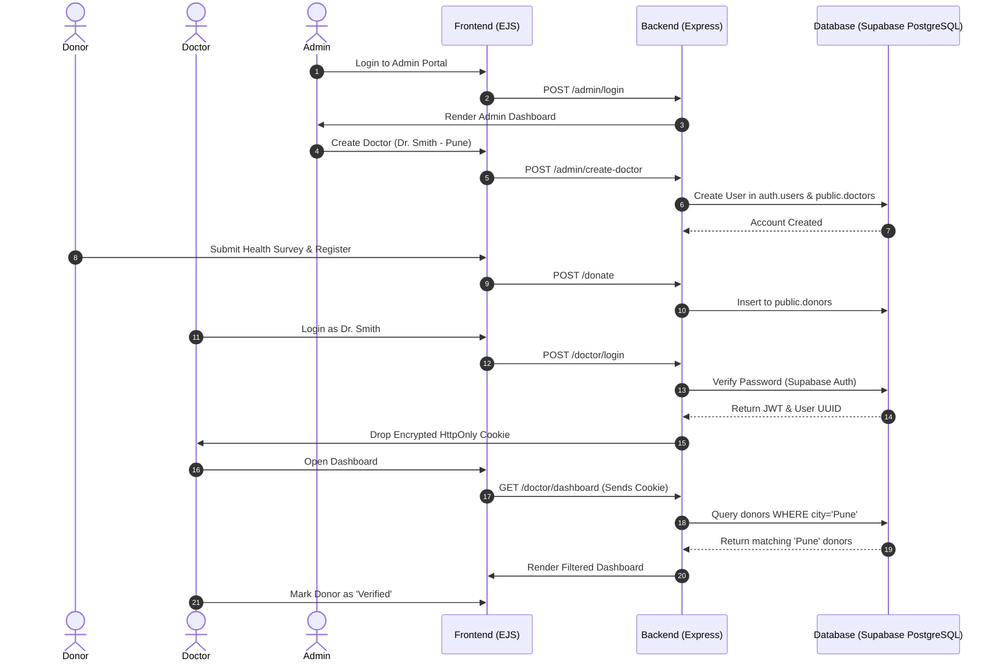

# 🩸 BloodLink — Advanced Blood Donation Flow Management

[](https://opensource.org/licenses/MIT)
[](https://nodejs.org/)
[](https://expressjs.com/)
[](https://supabase.com/)
[](https://www.postgresql.org/)
[](https://getbootstrap.com/)

## ✨ Connect, Verify, Save Lives.

BloodLink is a highly secure, role-based platform architected to streamline critical blood donation management. It bridges the gap between generous donors and authorized medical staff through a **city-scoped, multi-tier access control system** utilizing PostgreSQL Row-Level Security.

---

## 📋 Table of Contents

- [Key Features](#-key-features)
- [System Architecture & User Flow](#-system-architecture--user-flow)
- [Tech Stack & Security Layer](#-tech-stack--security-layer)
- [Getting Started](#-getting-started)
- [Environment Variables](#-environment-variables)
- [Contributing](#-contributing)

---

## 🌟 Key Features

### 👤 Donor Pipeline
- **Rapid Public Registration:** Server-side validated registration flows with mobile number indexing.
- **12-Point Health Declaration:** Auto-screens for age, weight, hemoglobin, medical history, and lifestyle constraints.
- **Auto-Eligibility Computation:** Calculates physical eligibility dynamically (Last Donation + 60 Days).
- **Public Status Tracker:** Donors can instantly track their hospital verification and availability status by simply entering their phone number into the public portal.

### 🩺 Medical Verification Operations (Doctor Dashboard)
- **Geographic Data Isolation:** Doctors strictly manage and view donors exclusively within their assigned city layout.
- **Status Management Lifecycle:** Controls donor pipeline (`available → contacted → donated_elsewhere → temporarily_unavailable → permanently_unavailable`).
- **One-Click Pre-Screening Access:** View detailed health profiles through dynamic modals.

### 🛡️ Administration & Operations
- **System-level Provisioning:** Doctors cannot self-register. Global admins provision credentials securely with localized assignments.
- **Revocation Systems:** One-click revocation of doctor accounts instantly destroys authorization traces in Auth and Database layers.

---

## 🗺️ System Architecture & User Flow

The application utilizes a micro-authentication flow to decouple the global admin connections from specific doctor sessions, preventing connection leakage and ensuring robust Row-Level Security (RLS) enforcement at the PostgreSQL level.

### User Flow Diagram



---

## ⚙️ Tech Stack & Security Layer

| Category | Technology | Architectural Choice |
|----------|-----------|---------|
| **Core Network** | Node.js / Express v5 | Chosen for highly concurrent asynchronous traffic handling. |
| **Data Engine** | Supabase (PostgreSQL) | Chosen for absolute relational integrity and Row-Level Security (RLS). |
| **Authentication** | Supabase Auth + HttpOnly Cookies | Combined Supabase Auth validation with Express securely-signed HttpOnly cookies to eradicate XSS credential theft. |
| **Rendering** | EJS + Bootstrap 5 | Extremely fast, Lightweight Server-Side-Rendering (SSR) specifically prioritizing immediate Time-To-Interactive. |

### Advanced Security
1. **Isolated Credentials & CSRF Protection:** Client logic heavily relies on securely-signed `express-session` cookies managed exclusively by the Node server, preventing any client-side JavaScript exposure.
2. **Brute Force Protection (`express-rate-limit`):** Defensive throttling implemented on all authentication routes.
3. **Content Security Policy (`helmet`):** Strict blocking of non-secure, third-party CDN injections and inline scripts.
4. **Row-Level Security (RLS):** Supabase database constraints ensure that even if the backend behaves unpredictably, no user can manipulate arbitrary rows.

---

## 🚀 Getting Started

### 1. Requirements
* Node.js v18+
* A completely free [Supabase](https://supabase.com/) Account

### 2. Installation
```bash
# Clone the repository
git clone https://github.com/yourusername/bloodlink.git
cd bloodlink

# Install all standard dependencies
npm install
```

### 3. Database Initialization
1. Create a new Supabase project.
2. Navigate to your Supabase **SQL Editor**.
3. Copy the entire contents of the local `supabase_schema.sql` file and run it. This will automatically generate all necessary Tables, Row-Level Security Policies, Auth Triggers, and Constraints!

### 4. Running the Dev Server
```bash
# Ensure your .env file is fully populated
node app.js
```
*Visit `http://localhost:3000` to interact with the platform live!*

---

## 🔐 Environment Variables

You must create a `.env` file at the root of the project. Base yours off `.env.example`:

```env
# Supabase Configuration
SUPABASE_URL="https://your-project-id.supabase.co"
SUPABASE_ANON_KEY="your-anon-public-key"
SUPABASE_SERVICE_ROLE_KEY="your-secret-service-role-key"

# Server Security
SESSION_SECRET="your-ultra-secure-random-phrase"
ADMIN_PASSWORD="super-secret-admin-pass"
```

---

## 🤝 Contributing
BloodLink is currently a final revision codebase, but PRs are heavily welcomed! Fork the repository, create a well-documented branch, run thorough database integration tests, and submit a PR for review.
